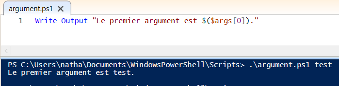
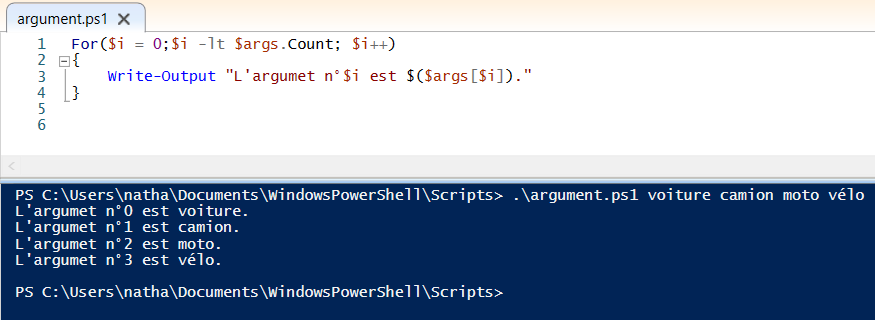
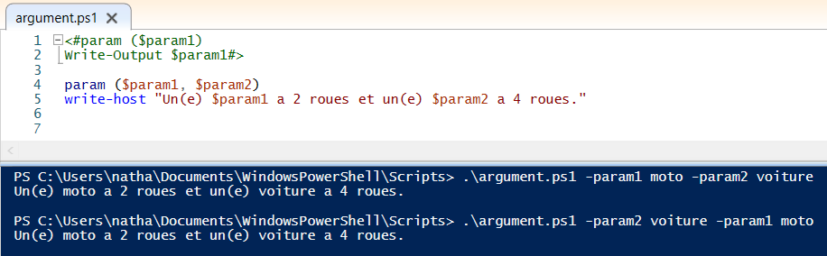

# Arguments et paramètres

## Qu'est-ce que c'est ?

Tout d'abord, il est important de faire la distinction entre paramètre et argument. Ces 2 notions sont intimement liées mais n'ont pas réellement la même définition.  

En effet, les **paramètres** d'une fonction correspondent aux noms listés dans la définition de la fonction.  
En revanche, les **argumets** d'une fonction correspondent eux aux valeurs réelles récupérées dans le programme.

 

## Méthode 1 : **$args**

Lorsque l'on exécute un fichier, il est possible de rajouter des arguments tout simplement séparés par des espaces. Ceux-ci seront forcément de type **string**.  

Il est possible de les récupérer facilement à l'aide de la variable **$args**. Celle-ci correspond au tableau des paramètres et sa valeur est donc obtenue lors de l'exécution du fichier. Voici un exemple simple d'utilisation :

Il est également facile de récupérer chaque arguments en bouclant le tableau comme ceci :

A noter : Ici, on boucle sur le nombre d'éléments dans le tableau, autrement dit sur la taille du tableau. La taille du tableau est récupérée à l'aide de la fonction **count**.

## Méthode 2 : **param**

Une deuxième méthode existe afin de traiter des paramètres et il s'agit de **param**. Celle-ci, contrairement à $args, ne fonctionne pas à l'aide d'un tableau mais comme un pointeur sur une variable.  
En effet, les paramètres seront nommés directement dans le porgramme et leurs valeurs pourront donc être rentrées dans la console dans n'importe quel ordre, contrairement à $args. Cela est rendu possible notamment grâce à l'utilisation de flags. Voici un exemple d'utilisation :

 

---

[Retour au sommaire](https://github.com/NatSch45/linux/blob/master/Powershell/README.md) | [Page suivante -->](https://github.com/NatSch45/linux/blob/master/Powershell/pages/scripts.md)