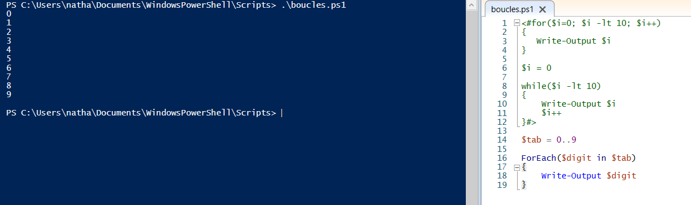

# Les boucles

La boucle est un indispensable à savoir maîtriser lors de la réalisation de scripts. Il permet notamment de parcourir des tableaux ou encore d'utiliser des suites arithmétiques, géométriques, etc...

La boucle simple se présente comme ceci :

    > For(<état initial>;<condition de répétition>;<incrémentation>)
    {
        <Si la condition est vraie, on exécute ce bloc d'instructions>
    }

Voici un exemple plus concret de l'utilisation d'une telle boucle :

Ici, la variable *$i* prend toutes les valeurs de 0 à 9.

Les conditions peuvent être multipliées.

---

Les boucles peuvent aussi s'écrire à l'aide de la fonction ***while()***. Le script ressemble alors à ceci :

    > While(<condition de répétition>)
    {
        <Si la condition est vraie, on exécutece bloc d'instructions>
    }

Avec cette fonction il est alors facile de créer une boucle "infinie", en faisant while(true).

Voici un exemple concret de l'utilisation de la fonction ***while()*** :

On peut facilement arriver au même résultat avec ce genre de boucle !

---

Un autre type de boucle s'appuie sur la lecture d'un tableau. En effet, il permet de parcourir chaque valeur du tableau. Le nombre d'itérations de la boucle correspondent au nombre d'éléments de mon tableau. De façon générique, la fonction ***ForEach()*** s'utilise comme ceci :

    > ForEach($ChaqueValeurDuTableau in $LeTableau)
    {
        <Tant qu'on arrive pas à la dernière du tableau, la boucle continue.>
    }

Voici comment il est possible de l'utiliser :

Ici, la variable *$digit* prend bien toutes les valeurs, une par une, contenues dans mon tableau *tab*.

---

Il est possible d'arrêter les itérations d'une boucle à l'aide de ***Break;***. Celui-ci stoppe immédiatement la boucle, peu importe ce qu'il se trouve après (dans la boucle).  
Il peut s'avérer très utile combiné à des conditions. Il peut permettre aussi d'améliorer la complexité d'un programme.

*Sources : https://www.it-connect.fr/powershell-et-les-boucles-for-loop/*  
*https://sodocumentation.net/fr/powershell/topic/1067/boucles*

 

---

[Retour au sommaire](https://github.com/NatSch45/linux/blob/master/Powershell/README.md) | [Page suivante -->](https://github.com/NatSch45/linux/blob/master/Powershell/pages/argsparam.md)