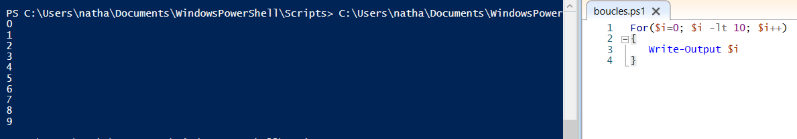
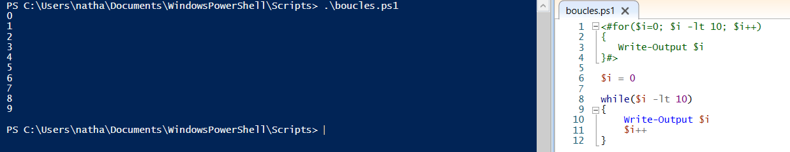

# Les boucles

La boucle est un indispensable à savoir maîtriser lors de la réalisation de scripts. Il permet notamment de parcourir des tableaux ou encore d'utiliser des suites arithmétiques, géométriques, etc...

La boucle simple se présente comme ceci :

    > For(<état initial>;<condition de répétition>;<incrémentation>)
    {
        <Si la condition est vraie, on exécute ce bloc d'instructions>
    }

Voici un exemple plus concret de l'utilisation d'une telle boucle :

Ici, la variable *$i* prend toutes les valeurs de 0 à 9.

Les conditions peuvent être multipliées.

---

Les boucles peuvent aussi s'écrire à l'aide de la fonction ***while()***. Le script ressemble alors à ceci :

    > While(<condition de répétition>)
    {
        <Si la condition est vraie, on exécutece bloc d'instructions>
    }

Avec cette fonction il est alors facile de créer une boucle "infinie", en faisant while(true).

Voici un exemple concret de l'utilisation de la fonction ***while()*** :

On peut facilement arriver au même résultat avec ce genre de boucle !

*Source : https://www.it-connect.fr/powershell-et-les-boucles-for-loop/*

 

---

[Retour au sommaire](https://github.com/NatSch45/linux/blob/master/Powershell/README.md) | [Page suivante -->](https://github.com/NatSch45/linux/blob/master/Powershell/pages/scripts.md)