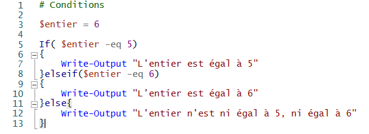

# Les conditions

Une exécution conditionnelle est composée de 2 parties : une condition et un code à exécuter. La condition est forcément de type booléen, c'est-à-dire qu'elle prend 2 valeurs possibles : *true* et *false*.

Sous PowerShell, elle se note à l'aide de la fonction ***If()*** (*si* ...) de la manière suivante :

        > If( $condition )
          {
              Code à exécuter
          }

Il faut bien penser à correctement incrémeter les codes à exécuter lorsqu'on "rentre" dans la condition.  

Dans l'exemple ci-dessous, on teste si l'entier est égal à 5. Ici, si oui, on affiche que l'entier est égal à 5.  

 simple")

Output :

 simple (output)")

On peut aller plus loin en indiquant quoi faire dans le cas où la condition n'est pas respectée, à l'aide de ***else*** (*sinon*). Voir l'exemple ci-dessous :  

/else")

Output :

/else (output)")

Il est possible d'enchaîner les conditions en utilisant ***elseif()*** (*sinon si* ...) comme ceci :

Output :

")

---

## Les opérateurs

### Les opérateurs de comparaison :

- **`-eq`** (**eq**ual) : "est égal à", il renvoit true si les 2 valeurs sont égales, sinon false
- **`-ne`** (**n**ot **e**qual) : "n'est pas égal à", il renvoit true si les 2 valeurs ne sont pas égales, sinon false
- **`-gt`** (**g**reater **t**han) : "strictement supérieur à"
- **`-ge`** (**g**reater than or **e**qual) : "supérieur ou égal à" 
- **`-lt`** (**l**ower **t**han) : "strictement inférieur à"
- **`-le`** (**l**ower than or **e**qual) : "inférieur ou égal à"
- **`-like`** : comparaison de chaînes de caractères  
**\*** : Correspond à un ensemble de caractères, peu importe lesquels  
**?** : Correspond à un caractère, peu importe lequel
- **`-is`** : Compare une variable à un type, si la variable est bien du type renseigné alors cela affiche true, sinon false.
- **`-isnot`** : Contraire de ***-is***.

### Les opérateurs logiques :

- **`-not`** : Retourne la valeur d'un booléen. Celui-ci devient donc true s'il était à l'origine false et devient false s'il était à l'origine true.
- **`!`** : Même utilisation que ***-not*** (plus conventionnel).
- **`-and`** : Renvoie true si les 2 expressions testées sont true, sinon false.
- **`-or`** : Renvoie true si au moins l'une des 2 expression est true, sinon false.
- **`-xor`** : Renvoie true si une et une seule des 2 expressions est true, sinon false.

>Les listes ci-dessus sont non-exhaustives.

## Commutateur (switch())

Il existe une autre fonction permettant de gérer des conditions et qui peut s'avérer très utile dans certains cas. Il permet de faire une série de conditions afin de tester une seule variable. Selon sa valeur les codes exécutés diffèrent. Voici comment l'utiliser :

")

Dans l'exemple ci-dessus, à la première exécution du code, la variable *$entier* vaut 5 puis 

On peut apercevoir un cas spécial à la fin, le cas "Default". Comme son nom l'indique, c'est un cas par défaut dont le bloc de code s'exécutera lorsqu'aucune autre condition n'a été remplie.  
Les cas s'enchaînent, c'est-à-dire qu'il est possible qu'une variable valide plusieurs conditions dans un même switch().  
Cependant, il est possible d'arrêter le switch() après qu'une condition soit remplie en rajoutant au bloc de code "; Break".

*Source : https://docs.microsoft.com/fr-fr/powershell/scripting/learn/deep-dives/everything-about-if?view=powershell-7.1#logical-operators*

 

---

[Retour au sommaire](https://github.com/NatSch45/linux/blob/master/Powershell/README.md) | [Page suivante -->](https://github.com/NatSch45/linux/blob/master/Powershell/pages/boucle.md)