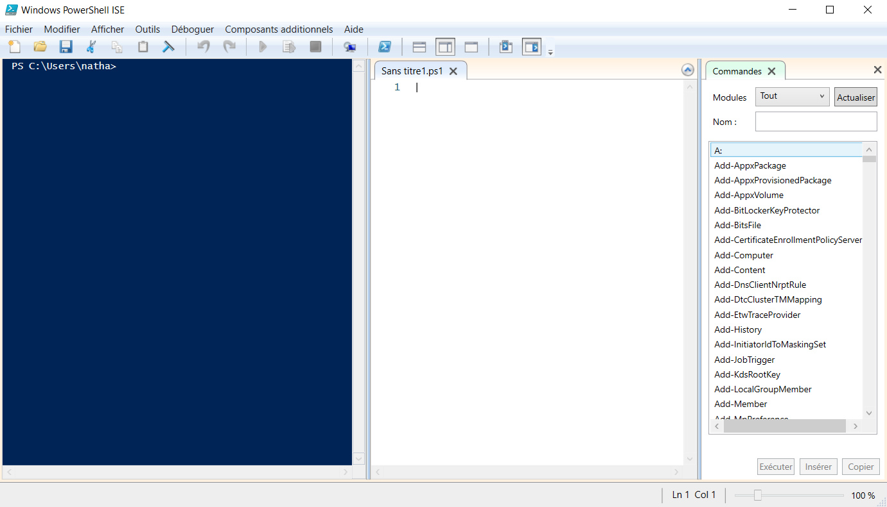
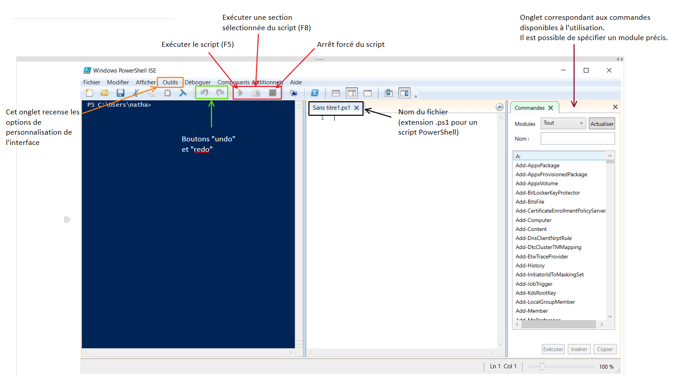

# Les scripts (PowerShell)

>Tout l'intérêt de PowerShell réside dans les scripts. Il s'agit d'un code, d'un ensemble de commandes stockées dans un fichier, qui lui est exécutable.  
Les fichiers de script PowerShell ont pour extension **.ps1**.  

>Un outil spécial autre que le terminal PowerShell existe afin de faciliter l'écriture des scripts, il s'agit de Windows PowerShell ISE. Il est bien évidemment possible d'utiliser un logiciel tierce tel que Visual Studio Code ou Atom par exemple. 

>Cette interface est composée, à gauche, d'un terminal affichant l'output du fichier dont le contenu est affiché à droite du terminal. Il est possible d'ailleurs d'observer le nom du fichier nommé ici "Sans titre1.ps1".  

>Un onglet est ici ouvert à droite de l'interface et il correspond au catalogue des commandes des modules actuellement installés sur votre machine.

>Dans l'onglet "outil", situé en haut de l'interface, il est possible d'accéder aux paramètres de personnalisation de l'interface

Tips : Un fichier non sauvegardé se verra concaténé une étoile à son nom.

Il faut savoir qu'une documentation officielle plus complète peut être consultée via la barre de menus (ou via [ce lien](https://docs.microsoft.com/fr-fr/powershell/scripting/windows-powershell/ise/exploring-the-windows-powershell-ise?view=powershell-7.1
)).

[Retour au sommaire](https://github.com/NatSch45/linux/blob/master/Powershell/README.md) | [Page suivante -->](https://github.com/NatSch45/linux/blob/master/Powershell/pages/tps/tp.md)