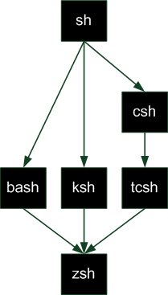

<!DOCTYPE html>
# Les shells

Un shell est un environnement console. Il en existe plusieurs, à la même manière des interfaces graphiques, et ils comportent quelques différences souvent non visibles mais présentes lors de l'écriture des commandes et scripts.  
Voici une liste non-exhaustive des shells disponibles :

- **sh** (Bourne Shell) : C'est l'ancêtre de tous les shells. Il est utilisé seulement pour l'écriture de procédures 
- **bash** (Bourne Again Shell) : Une amélioration du Bourne Shell, disponible par défaut sous Linux et Mac OS X.
- **ksh** (Korn Shell) : Un shell puissant assez présent sur les Unix propriétaires, mais aussi disponible en version libre, compatible avec bash.
- **csh** (C Shell) : Un shell utilisant une syntaxe proche du langage C, même si le C signifie ici "California". Il est plûtot conçu pour une interface avec les utilisateurs
- **tcsh** (Tenex C Shell) : Amélioration du C Shell, pour faire concurrence au *Korn Shell*
- **zsh** (Z Shell) : Shell assez récent reprenant les meilleures idées de *bash*, *ksh* et *tcsh*

 

Voici un graphique représentant l'évolution des shells, notamment via leur héritage :

  

 

On peut alors se poser la question sur l'intérêt aujourd'hui d'utiliser le Bourne Shell. En fait, le sh est toujours aussi utilisé car il est encore présent sur chaque système UNIX (Linux ou Mac OS)

---

Sur un système UNIX, on peut facilement changer de shell en le téléchargeant comme un simple package.

Exemple pour installer Korn Shell :

    > apt-get install ksh

Après ça, il faudra indiquer à notre shell qu'on veut changer justement de shell en utilisant la commande (change shell) :

    > chsh

A ce moment là, l'invite de commande vous demandera un chemin d'accès jusqu'au nouveau shell. Les shells se trouvent dans le dossier /bin.
Par exemple, pour utiliser ksh il faudra rentrer /bin/ksh, pour bash il faudra rentrer /bin/bash etc...

 

> Sources : [OpenClassroom]( https://openclassrooms.com/fr/courses/43538-reprenez-le-controle-a-laide-de-linux/42867-introduction-aux-scripts-shell ), [belaran.github.io](http://belaran.github.io/free-docs/unix-initiation/node57.html)

[Retour au sommaire](https://github.com/NatSch45/linux/blob/master/Powershell/README.md) | [Page suivante -->](https://github.com/NatSch45/linux/blob/master/Powershell/pages/commandes.md)