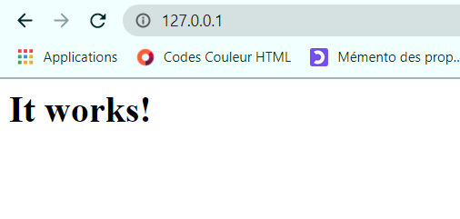

# TP2 - Exercice d'installation automatique d'un serveur web Apache

## Rappel des objectifs :

- installer Apache
- activer ou désactiver des modules apache
- lister les modules apaches actifs
- lister les modules apaches non actifs, mais disponibles
- créer un nouveau répertoire pour accueillir un nouveau site web (avec la création des virtualhost automatique)

---

Tout d'abord, il faut installer Apache depuis le site officiel en choisissant la version correspondante au système : https://www.apachelounge.com/download/.  
Le document téléchargé devra ensuite être dézippé dans le dossier souhaité.
La prochaine étape consiste à changer la valeur de la variable ***SRVROOT*** présente dans le fichier *conf/httpd.conf*. La nouvelle valeur correspondra au nouveau chemin d'accès, si il est bien différent de l'original, à votre répertoire Apache24.  

Il faudra ensuite ouvrir PowerShell à l'emplacement du dossier bin de votre Apache afin d'y exécuter la commande suivante :

    > & "D:\Apache\bin\httpd.exe"

Attention, il faut correctement adapter le chemin d'accès à votre fichier. Quand la commande sera rentrée, une fenêtre apparaîtra sûrement, il faut autoriser l'accès.

Cette commande permet d'autoriser l'accès aux autres utilisateurs de se connecteur sur votre serveur Apache.  

Afin de vérifier que le serveur Apache est correctement lancé, il suffit de se rendre sur cette adresse [localhost](http://127.0.0.1) et d'observer si le message suivant est bien affiché :

---

Il est possible d'afficher les modules présents en tapant la commande ci-dessous :

    > ls D:\Apache\modules

en prenant soin de remplacer *D:\Apache\\* par le bon chemin d'accès.

---

[Retour aux TPs](https://github.com/NatSch45/linux/blob/master/Powershell/pages/tps/tp.md) | [TP suivant -->](https://github.com/NatSch45/linux/blob/master/Powershell/pages/tps/tp3.md)