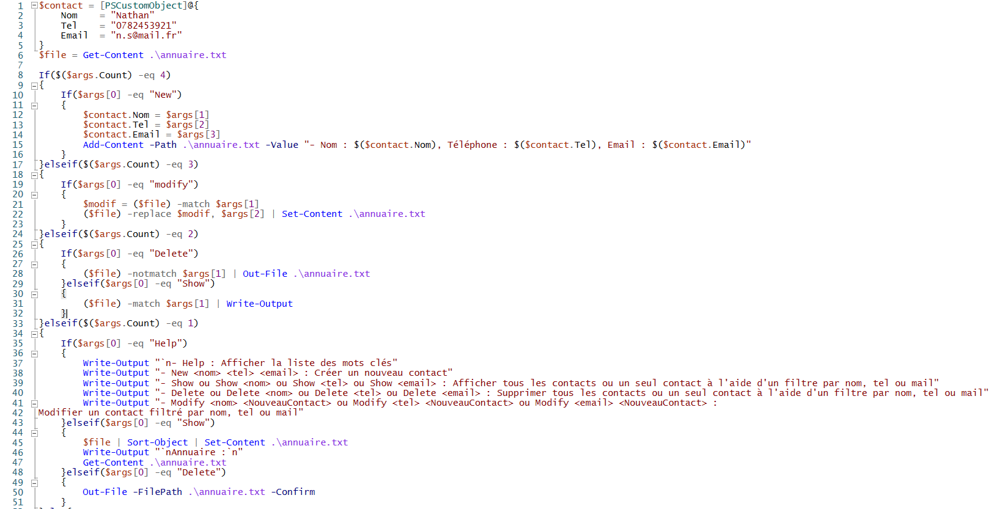
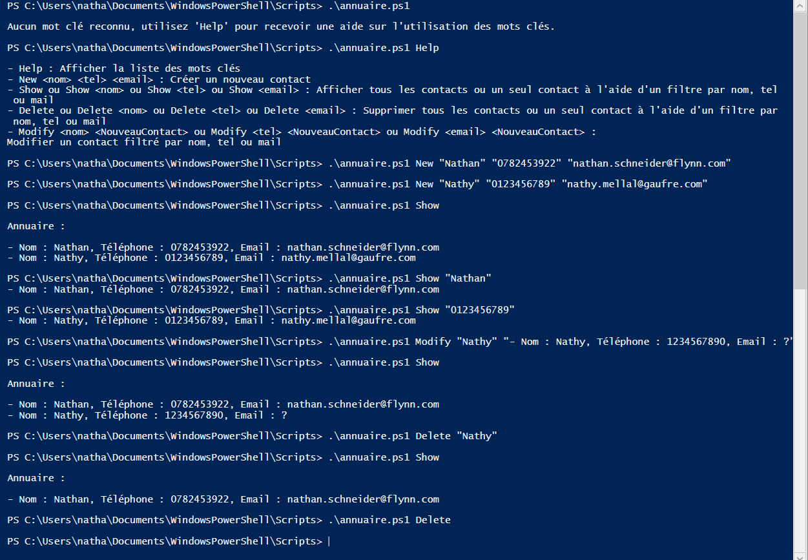
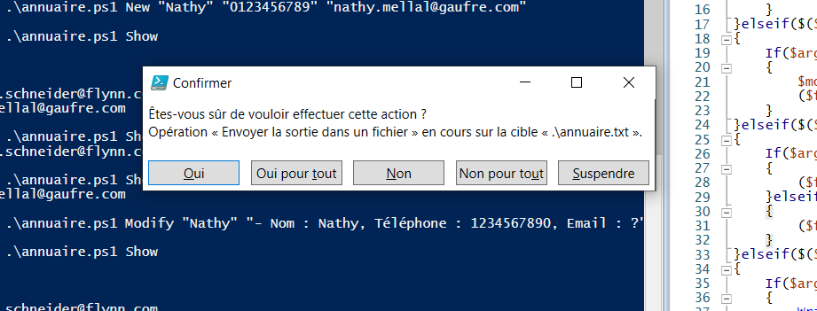

# TP4 - Créer un annuaire téléphonique

## Rappel des objectifs :

Le script devra permettre la gestion d'un annuaire téléphonique. Il devra inclure les fonctionnalités suivantes : 

- ajouter un contact (nom + tel + mail)
- modifier un contact
- voir la liste de tous les contacts (triés par ordre alphabétiques grâce à leurs noms et n'afficher que leurs noms)
- voir le détail d'un contact grâce à son nom
- retrouver le nom d'un contact grâce à son adresse mail
- retrouver le nom d'un contact grâce à son téléphone
- supprimer un contact

L'ensemble des informations devront être enregistrées dans un fichier texte.

---

### Voici mon code pour le TP de l'annuaire

  

Afin de structurer l'information, un objet propre à ce programme a été créé. Il s'agit de la variable **$contact**. Cet objet stocke plusieurs variables, il est possible donc ici d'enregistrer un contact qui a un nom, un numéro de téléphone et une adresse mail.

### Les fonctions à retenir sont les suivantes :

- ***Write-Output*** : Afin de passer des messages (d'erreur ou informationnels) à l'utilisateur

- ***Get-Content*** : Permet de récupérer les données d'un fichier sous forme de tableau de lignes

- ***Add-Content*** : Permet d'ajouter du contenu à un fichier, par exemple ici un évènement

- ***Out-File*** ou ***Set-Content*** : Permet d'intéragir avec les données d'un fichier, notamment les modifier ou les supprimer

- ***Sort-Object*** : Permet de trier un contenu, par défaut dans l'ordre alphanumérique ASCII

### Voici un exemple d'utilisation du programme

  

On peut s'apercevoir qu'il est plutôt facile d'utiliser le programme.

  

Lorque l'utilisateur souhaite supprimer TOUT les contacts, une fenêtre de confirmation s'affiche afin d'éviter toute étourderie.

 

---

[Retour aux TPs](https://github.com/NatSch45/linux/blob/master/Powershell/pages/tps/tp.md) | [TP suivant -->](https://github.com/NatSch45/linux/blob/master/Powershell/pages/tps/tp5.md)
