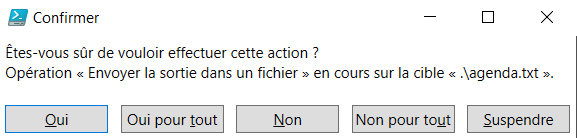

# TP5 - Créer un agenda

## Rappel des objetifs

Le script devra permettre de gérer un agenda. Il devra inclure les fonctionnalités suivantes :

- ajouter un évènement (date + heure + nom + durée)
- voir la liste des évènements par ordre chronologique
- modifier un évènement
- supprimer un évènement

L'ensemble des informations devront être enregistrées dans un fichier texte.

---

### Voici mon code pour le TP de l'agenda

  

Ici, les actions principales sont gérées.

### Les fonctions à retenir dans ce cas-ci sont :

- ***Write-Output*** : Afin de passer des messages (d'erreur ou informationnels) à l'utilisateur

- ***Get-Date*** : Permet de travailler avec des dates, sous un format approprié à ce genre de donnée

- ***Get-Content*** : Permet de récupérer les données d'un fichier sous forme de tableau de lignes

- ***Add-Content*** : Permet d'ajouter du contenu à un fichier, par exemple ici un évènement

- ***Out-File*** ou ***Set-Content*** : Permet d'intéragir avec les données d'un fichier, notamment les modifier ou les supprimer.

Il est possible de récupérer le nombre de lignes d'un fichier en combinant la commande **Get-Content** et ***count***.  
Tips : En remplaçant ***count*** par ***length***, on peut obtenir le nombre de caractères.

Lorsque l'on supprime TOUT le fichier, une fenêtre de confirmation s'ouvre afin d'éviter les potentielles étourderies de l'utilisateur.

### Voir ci-dessous

  

 

### Voici un exemple d'utilisation du code dans la console

  

On peut voir qu'il est plutôt simple d'utiliser le fichier pour organiser un agenda.  

### Afin d'améliorer l'aisance d'utilisation du programme, les erreurs principales sont gérées comme ceci

  

### Voici une fonctionnalité ajoutée en cours de route

  

Il est désormais possible de modifier un évènement.

 

---

[Retour aux TPs](https://github.com/NatSch45/linux/blob/master/Powershell/pages/tps/tp.md)
