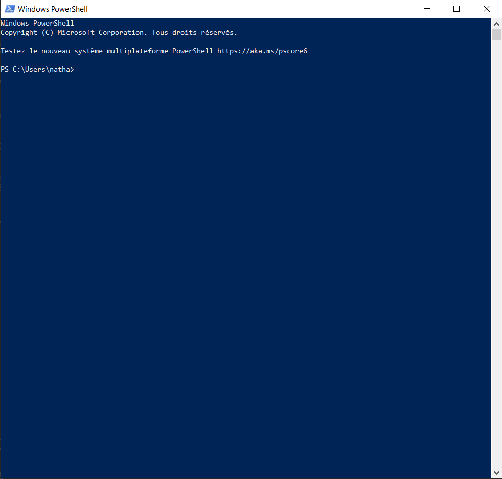

# Windows PowerShell

> "PowerShell est un langage de script fondé sur la programmation orientée objet. Le logiciel PowerShell (fichier exécutable powershell.exe ) est l’interpréteur de l’interface en ligne de commande de l’environnement de développement Windows PowerShell." sur [OpenClassrooms]( https://openclassrooms.com/fr/courses/6344196-planifiez-vos-taches-avec-des-scripts-powershell-sur-windows-server/6527315-utilisez-les-commandes-de-base-de-powershell)

> "Les commandes PowerShell sont constituées d’un verbe ou préfixe et d’un nom, séparés par un tiret. Elles peuvent être suivies de paramètres, on les appelle des commandlets ou cmdlets (command applets) en anglais et phrases ou commandelettes en français." sur [OpenClassrooms]( https://openclassrooms.com/fr/courses/6344196-planifiez-vos-taches-avec-des-scripts-powershell-sur-windows-server/6527315-utilisez-les-commandes-de-base-de-powershell)

---

Ce logiciel est utilisé pour la gestion de la configuration et de l'automatisaion des tâches.

---

Voici l'interface graphique PowerShell, notamment reconnaissable à sa couleur de fond bleue :  

Les commandes "sudo" en shell UNIX, permettant d'exécuter une commande en tant qu'administrateur système, peuvent ici être réglées en lançant simplement le logiciel en tant qu'administrateur.

[Retour au sommaire](https://github.com/NatSch45/linux/blob/master/Powershell/README.md)
