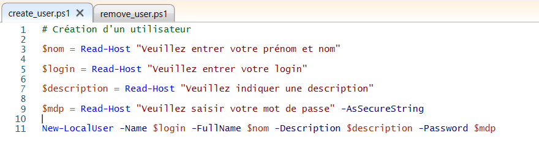
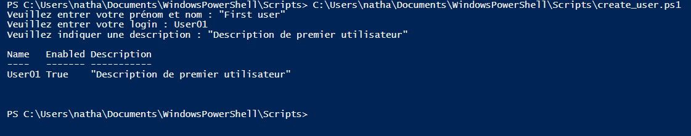
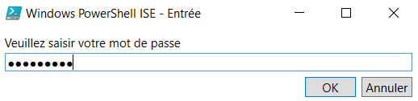
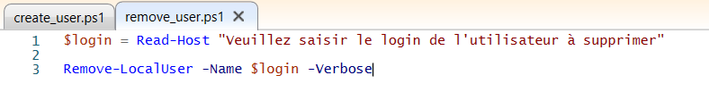

# TP1 - Scripts de gestion des comptes utilisateurs

## Rappel des objectifs :

- créer des utilisateurs
- modifier des utilisateurs
- supprimer des utilisateurs
- voir tous les utilisateurs
- faire une recherche sur l'existence d'un utilisateur en particulier

 

## Script de création d'un utilisateur

On crée un nouvel utilisateur local à l'aide de la commande ***New-LocalUser***.

  

On demande à l'utilisateur (de la console) de rentrer respectivement le nom et le prénom de l'utilisateur, le login du compte, une description du compte (non obligatiore) puis un mot de passe. Seul le login est vraiment obligatoire.

---

  

Voici ce qui est donc affiché dans la console. Ici je crée un utilisateur nommé "First user" avec comme login "User01" et une description "Description de premier utilisateur".

  

Une nouvelle fenêtre permettant de saisir une chaîne de caractère (ici un mot de passe) sécurisé s'affiche grâce à l'option ***-AsSecureString***.

---

## Script de suppression d'un utilisateur

On supprime un utilisateur local à l'aide de la commande ***Remove-LocalUser***.

  

Dans ce script, l'utilisateur sera supprimé en fonction de son login, qu'on demande à l'utilisateur de la console.

 

---
[Retour aux TPs](https://github.com/NatSch45/linux/blob/master/Powershell/tp.md)
